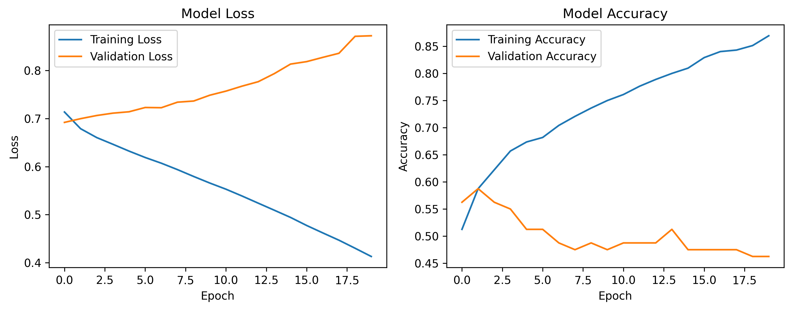

# Tutoriel du Modèle de Classification Binaire

Décomposons notre modèle d'IA étape par étape de manière simple ! 🚀

## 1. Mise en Place
D'abord, nous préparons notre ordinateur en :
- Désactivant les avertissements inutiles de TensorFlow
- Chargeant les outils nécessaires (comme NumPy pour les mathématiques et Matplotlib pour les graphiques)
- Configurant Matplotlib pour fonctionner sans affichage à l'écran

*Structure de base du projet*

## 2. Création des Données d'Entraînement
Nous créons des données fictives pour entraîner notre IA :
- Création de 1000 échantillons avec 30 mesures différentes (comme avoir 1000 personnes avec 30 caractéristiques)
- Attribution d'une étiquette 0 ou 1 (comme oui/non ou vrai/faux)
- Division des données en deux groupes :
  * Données d'entraînement (pour enseigner à l'IA)
  * Données de test (pour vérifier l'apprentissage)
- Normalisation des nombres (cela aide l'IA à mieux apprendre)

*Visualisation de la structure des données*

## 3. Construction du Cerveau de l'IA
Nous créons un réseau neuronal avec trois couches :
1. Première couche (64 neurones) : Reçoit nos 30 mesures
2. Couche intermédiaire (32 neurones) : Traite l'information
3. Dernière couche (1 neurone) : Prend la décision finale oui/non
- Utilisation de 'ReLU' pour les deux premières couches
- La dernière couche utilise 'sigmoid' pour donner une réponse oui/non

*Architecture du réseau neuronal*

## 4. Phase d'Entraînement
Nous entraînons notre IA en :
- Montrant les exemples 20 fois (époques)
- Alimentant 32 échantillons à la fois (taille du lot)
- Utilisant 10% des données pour vérifier les progrès
- Gardant l'entraînement silencieux (verbose=0)

*Visualisation du processus d'entraînement*

## 5. Création des Graphiques
Nous créons deux graphiques pour voir l'évolution de l'apprentissage :
- Graphique gauche : Montre si l'IA s'améliore
- Graphique droit : Montre la précision de l'IA
- Sauvegarde des graphiques dans 'model_training_plots.png'

*Graphiques montrant la progression de l'apprentissage*

## 6. Test Final
Enfin, nous :
- Testons notre IA avec des données nouvelles
- Affichons sa précision (comme une note finale !)

## Expérimentez Par Vous-Même ! 
Voici quelques modifications possibles :
- Changez le nombre d'exemples d'entraînement (actuellement 1000)
- Ajustez le nombre de répétitions d'entraînement (époques)
- Modifiez la taille du réseau neuronal
- Changez la vitesse d'apprentissage (learning rate dans l'optimiseur Adam)

N'oubliez pas : L'apprentissage de l'IA est comme dresser un animal - il faut de la patience, et parfois essayer différentes approches pour obtenir les meilleurs résultats ! 🐕🎓
